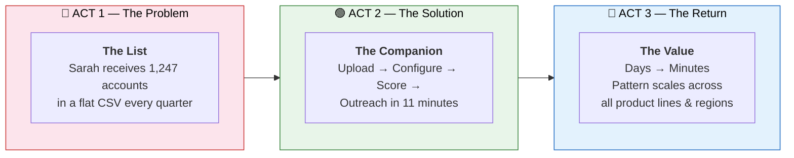
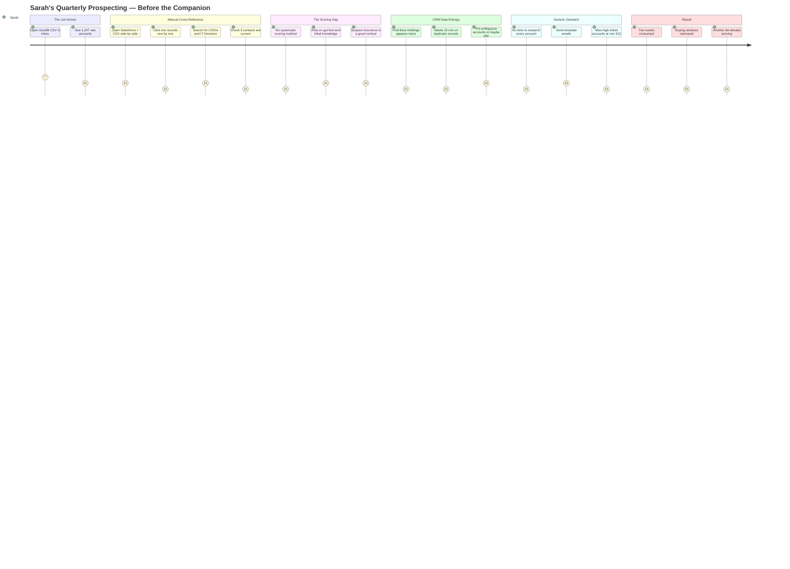
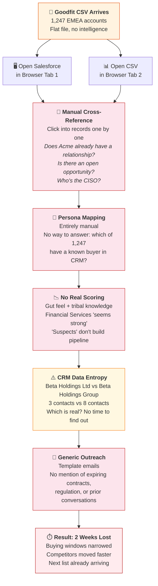
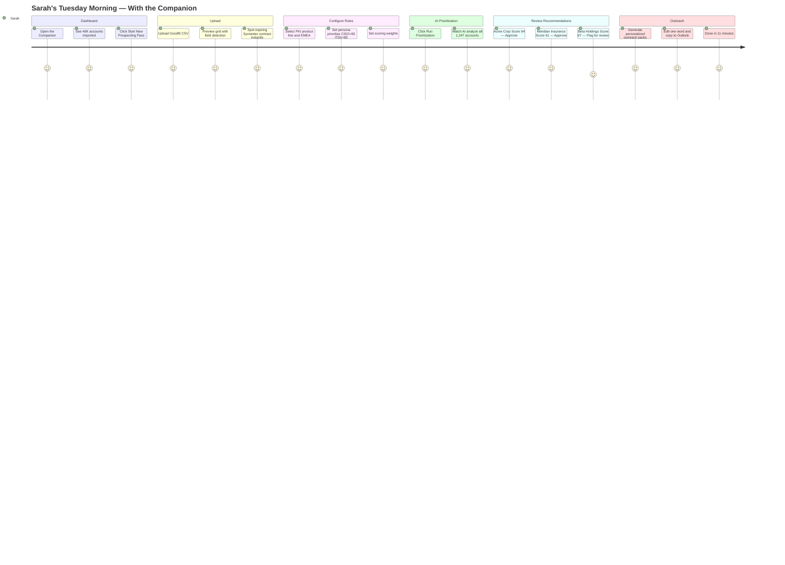
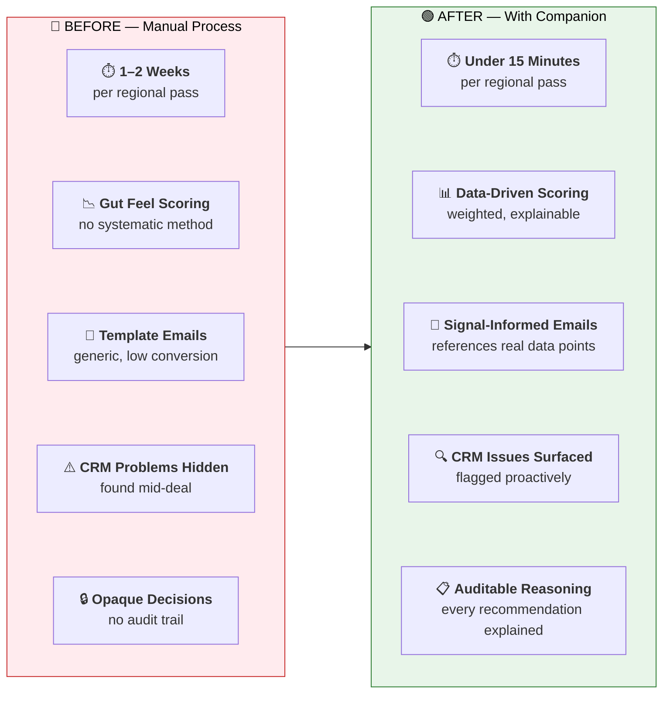
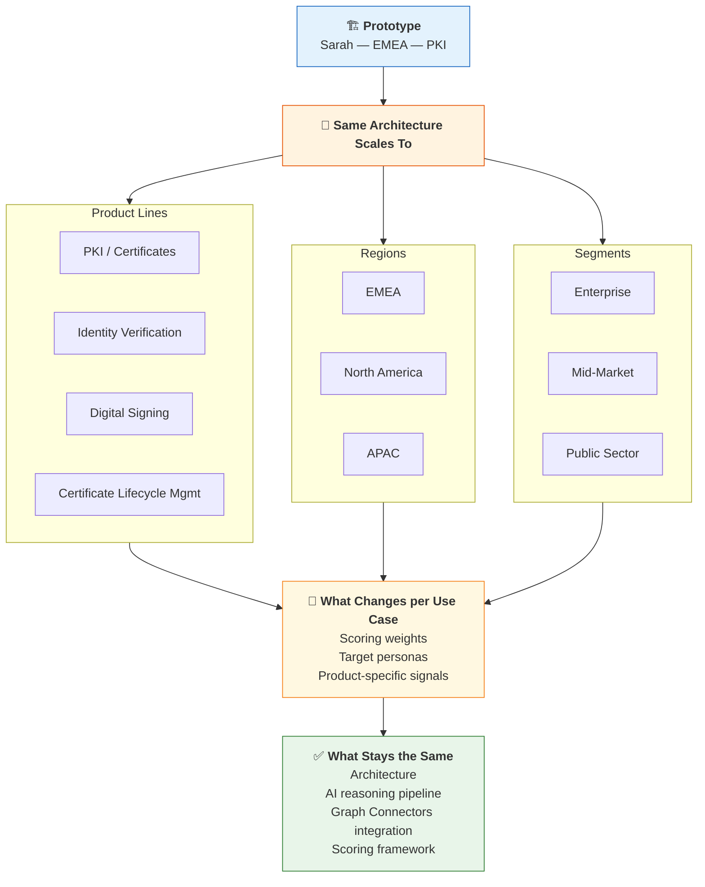

# Prospect Prioritization Companion — Story Diagram & Storytelling Guide

> Use this document alongside the narrative story. Each diagram maps to an Act, with speaker annotations to guide the storytelling flow.

---

## Overview: The Three-Act Arc

> **Speaker note:** Open with the arc. "This is a story in three parts — a problem everyone in sales recognises, a prototype we built in hours, and the compounding value it unlocks."

---

## Act 1: The Problem — Sarah's Current Workflow

### Pain Journey

> **Speaker note:** "This is Sarah Chen — enterprise rep, EMEA, PKI solutions. She's closed seven-figure deals. But the hardest part of her job isn't closing. It's finding which deals to chase."

### The Manual Process (Detail)

> **Speaker note:** Pause on the quote — *"The worst part isn't the manual work — it's knowing that somewhere in that list, there are accounts with an expiring contract and a CISO who's actively looking for alternatives. And I'm going to miss them because I ran out of time on row 312."*

---

## Act 2: The Solution — The Companion Workflow

### Solution Journey

> **Speaker note:** "Same person. Same data. Same Tuesday morning. Completely different outcome."

### The Companion Workflow (Step-by-Step)

```mermaid
flowchart TD
    START["`🏠 **Dashboard**
    40,127 accounts imported
    2,340 prioritized this month
    156 outreach packs sent`"]

    START --> UPLOAD["`📤 **Upload Goodfit CSV**
    1,247 EMEA accounts
    Instant field detection
    ✨ Enrichment visible immediately:
    _Acme Corp — Expiring Symantec
    contract Q2 2026_`"]

    UPLOAD --> CONFIG["`⚙️ **Configure Scoring Rules**`"]

    subgraph RULES["What Sarah Configures"]
        direction LR
        R1["`**Product Line**
        PKI / Certificate
        Solutions`"]
        R2["`**Personas**
        CISO → 95
        IT Director → 80
        IAM Lead → 70`"]
        R3["`**Weights**
        Persona Fit — 80%
        Industry — 70%
        Company Size — 60%
        CRM Signals — 40%
        Web/Intent — 30%`"]
    end

    CONFIG --> RULES
    RULES --> RUN["`▶️ **Run Prioritization**`"]

    subgraph ENGINE["What Happens Behind the Scenes"]
        direction TB
        E1["`🤖 Copilot Studio
        orchestrates AI reasoning`"]
        E2["`🔗 Graph Connectors
        query Salesforce index
        (read-only, item-level ACLs)`"]
        E3["`📊 Graph API
        cross-references Goodfit data
        from SharePoint`"]
        E4["`🧠 AI scores every account
        against weighted criteria
        + generates explanations`"]
        E1 --> E2 --> E3 --> E4
    end

    RUN --> ENGINE
    ENGINE --> RECS["`⭐ **Recommendations Screen**
    _— The Hero Moment —_`"]

    subgraph ACCOUNTS["Ranked Accounts with AI Reasoning"]
        direction TB
        ACC1["`✅ **Acme Corp — 94/100**
        CISO Jane Smith in Salesforce
        Financial Services, 5,200 emp
        Expiring Symantec contract Q2 2026
        No existing Entrust relationship`"]

        ACC2["`✅ **Meridian Insurance — 91/100**
        VP InfoSec Pierre Dubois
        Digital transformation initiative
        Expected RFP H2 2026
        Dormant lead from 2024`"]

        ACC3["`✅ **Gamma Financial — 89/100**
        IT Director Klaus Weber
        EU digital identity regulation
        Previous demo request 2025 went cold
        Re-engagement opportunity`"]

        ACC4["`⚠️ **Beta Holdings — 87/100**
        NEEDS REVIEW — CRM Duplicate
        'Beta Holdings Ltd' vs 'Group'
        Shared domain, different records
        Contact email missing`"]
    end

    RECS --> ACCOUNTS

    ACCOUNTS --> ACTION{"`**Sarah's Decision**
    3 clicks per account`"}

    ACTION -->|Approve| APPROVED["✅ Approved for Outreach"]
    ACTION -->|Flag| FLAGGED["🔍 Flagged for Review"]
    ACTION -->|Dismiss| DISMISSED["❌ Dismissed"]

    APPROVED --> OUTREACH_PACK["`📨 **Generate Outreach Pack**
    Personalized emails per account
    NOT templates — signal-informed`"]

    subgraph EMAIL["Example: Acme Corp Draft"]
        direction TB
        DRAFT["`_'With Acme Corp's Symantec certificate
        contract approaching its Q2 2026 renewal
        window, this is the moment most enterprise
        CISOs reassess their PKI strategy —
        particularly around automation,
        crypto-agility, and compliance posture.'_`"]
        PROV["`📋 **Personalization Note**
        Sources: expiring contract, company size,
        industry vertical, CISO role match`"]
    end

    OUTREACH_PACK --> EMAIL
    EMAIL --> OUTLOOK["`📧 **Open in Outlook**
    Copy with one click
    Ready to send`"]

    OUTLOOK --> DONE["`⏱️ **Total Time: 11 Minutes**`"]

    style START fill:#e3f2fd,stroke:#1565c0
    style UPLOAD fill:#e8f5e9,stroke:#2e7d32
    style CONFIG fill:#fff3e0,stroke:#e65100
    style RUN fill:#f3e5f5,stroke:#6a1b9a
    style RECS fill:#fff8e1,stroke:#f57f17
    style ACC4 fill:#fff3e0,stroke:#e65100
    style DONE fill:#e8f5e9,stroke:#2e7d32
    style OUTREACH_PACK fill:#e8f5e9,stroke:#2e7d32
    style OUTLOOK fill:#e3f2fd,stroke:#1565c0
```

> **Speaker note:** Walk through each step slowly. The hero moment is the Recommendations screen — pause and let the audience read one account card. Then highlight Beta Holdings: "This is where the Companion earns its keep in a different way — it surfaces a CRM problem Sarah would have hit on day three, and asks for her judgment. Human-in-the-loop, not black box."

> **Key quote:** *"The part that got me wasn't the speed — it was the AI telling me why. I've never had a tool that shows its work like that."*

---

## Act 3: The Value — Before vs. After

### Before & After Comparison

> **Speaker note:** "This isn't incremental improvement. Days become minutes. Gut feel becomes a calibration input. Templates become conversations. And CRM problems that used to ambush reps mid-deal are surfaced before outreach even begins."

### Scaling the Pattern

> **Speaker note:** "What was built for one seller is a pattern that scales across every product line, region, and segment Entrust sells. The weights change. The personas change. The fundamental problem — turning an undifferentiated list into an actionable, explained outreach plan — is universal."

---

## Quick Reference: Storytelling Beat Sheet

| Beat | Diagram | Key Message | Emotional Note |
|------|---------|-------------|----------------|
| **Open** | Three-Act Arc | "Problem → Solution → Value" | Set expectations |
| **The Pain** | Pain Journey + Manual Process | Sarah is skilled, the system is broken | Empathy |
| **The Quote** | *(pause, no diagram)* | "I ran out of time on row 312" | Frustration |
| **The Turn** | Solution Journey | Same person, same data, different outcome | Relief |
| **The Walkthrough** | Companion Workflow | Step-by-step through the tool | Building excitement |
| **The Hero Moment** | Account Cards in Workflow | AI shows its reasoning | "The part that got me" |
| **The CRM Save** | Beta Holdings (amber card) | Human-in-the-loop, not black box | Trust |
| **The Transformation** | Before vs. After | Days → Minutes, gut → data | Impact |
| **The Scale** | Scaling the Pattern | One prototype → entire org | Strategic vision |
| **The Close** | Roadmap | What's built, what's next | Forward momentum |
